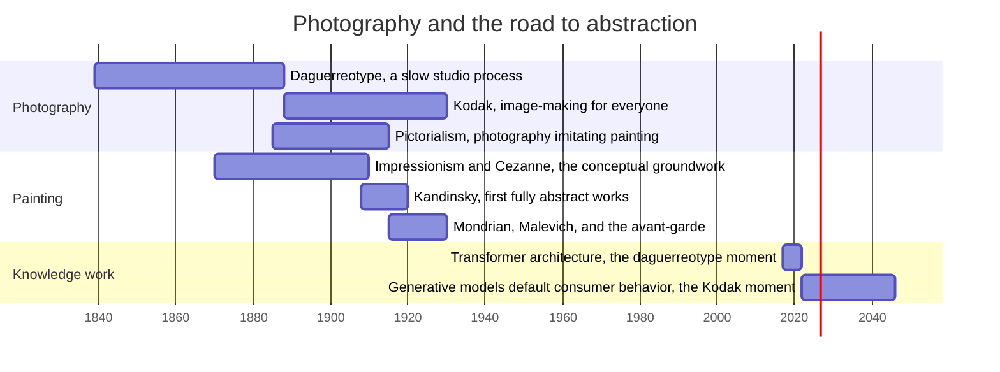

The standard story goes like this. In 1839, when the daguerreotype was unveiled in Paris, the painter Paul Delaroche reportedly declared that painting was dead. Photography could record appearances faster, cheaper, and more faithfully than any trained hand, so painting had to find something else to do. What it found, eventually, was abstraction. Kandinsky's first non-representational watercolors date from around 1910, and within a decade Mondrian, Malevich, and the rest of the avant-garde had abandoned the depiction of the visible world entirely. Photography pushed painting out of representation, and painting answered by becoming modern art.

It is a tidy story, and like most tidy stories it survives contact with the timeline only in modified form. Photography existed for seventy years before abstraction arrived. The daguerreotype of 1839 was a slow, studio-bound process, good for portraits and still lifes, and for decades its influence on painting ran the other way: photographers staged tableaux and softened focus to imitate the academic canvases of the day. Pictorialism, the school of photography that most wanted to be painting, peaked between 1885 and 1915, *after* the Kodak had made photography a mass consumer product. The two media spent decades circling each other before painting definitively jumped.

{.timeline}

The decisive alignment is much tighter than the seventy-year gap suggests. Impressionism and Cézanne, the conceptual groundwork for abstraction, matured in the period when photography was still a novelty, a portrait tool, a reference aid that Degas and Delacroix used without anxiety. What changed around 1888 was not what photography could do but who could do it. The Kodak, with its slogan "You press the button, we do the rest," turned image-making into something anyone could do without skill. Twenty years later, painting had produced its first fully abstract works. Abstraction arrived not when photography appeared, but when it became the default way of making pictures.

This suggests a different reading of the causality. Photography did not make abstraction possible. It made abstraction urgent. The internal arguments for it were already in place: the Romantic discovery that a painting could be about feeling rather than subject; Cézanne's insistence that the canvas was a constructed surface rather than a window; the lessons of Japanese prints and African sculpture, which showed European painters that representation was a choice, not a requirement. (Theosophists beat him to it, in fact: Hilma af Klint painted fully abstract works in 1906, five years before Kandinsky, but kept them private, and the avant-garde never saw them, so she remains an existence proof rather than a turning point.) Kandinsky's own breakthroughs came from theosophy and from music, the one art that had always managed without depicting anything. What photography dissolved was the economic and social necessity of representational skill. The miniature portrait trade disappeared almost overnight in the 1850s, and with it the assumption that a painter's value lay in faithful recording. Once the subsidy for the old job was gone, a minority aesthetic position could become the mainstream. Automation, in general, rarely creates a new discipline. It removes the subsidy for the old one, and lets the niche interest take over.

I think this is the most useful lens for thinking about what large language models are doing to knowledge work, and I do not mean that in the comforting way.

The obvious parallel is being drawn constantly, if mostly by analogy and anecdote: generative models now produce summaries, reports, first drafts, code reviews, routine analyses, the representational labor of the knowledge economy. This is the daguerreotype moment, and the fear version of the argument is that knowledge work is dead the way portrait painting was dead. Anyone who has watched a model produce a competent first draft of a document that used to take a day understands the force of the comparison. The commercial portrait studios did disappear, almost completely, within a decade.

But the painting history suggests this is the wrong question, in the same way "will painting survive" was the wrong question in 1850. Painting survived. What died was a job, not a practice, and the practice that emerged was one nobody had been able to see clearly from inside the representational era. So the interesting question is not whether AI can do knowledge work's recording job, because it demonstrably can and will. It is what the internal, non-automatable arguments of knowledge work already are, the way Cézanne and Kandinsky's arguments were already in place, and what it will take for them to become the mainstream.

The timeline offers one warning and one encouragement. The warning is Pictorialism. For decades, photographers responded to the camera's inferiority complex by imitating painting, and painters, for a shorter period, imitated photography's flatness and framing. During a media transition, the degraded equilibrium is imitation: each side producing a worse version of the other. We are squarely in that phase for knowledge work. Students submitting generated prose; professionals laundering generated text through light editing; analysts treating model output as a finished product rather than a draft of an argument nobody has taken responsibility for. That is the Pictorialist phase of knowledge work, and it can last a long time, long enough for a career.

The encouragement is the twenty-year window. The transformer architecture behind the current models dates from 2017, but that is the daguerreotype, the slow studio process. The Kodak moment, the point at which the capability becomes a default consumer behavior rather than a specialist tool, arrived in late 2022. If painting is the precedent, the decisive artistic and intellectual responses should cluster in the following two decades, which means they are being formed right now, by people who have stopped asking what the machine can do and started asking what the work is for.

So what is the abstraction of knowledge work? What is the equivalent of the move from depicting the world to constructing the picture? My answer, from my own practice leading a data analysis unit, is that the irreducible core is judgment, and specifically responsibility for a conclusion. A model can generate an analysis; it cannot be accountable for it. It can produce a p-value; deciding whether the design behind the data supports the inference requires someone who will stand behind the result when it is wrong. Framing the question, choosing what is worth measuring, judging whether an output is plausible before it propagates, auditing the code rather than writing it: these are the non-representational activities, the ones that exist because a human is in the loop, not despite it. They were always the senior end of the profession. The camera did not abolish painting; it abolished the idea that painting's value was fidelity, and promoted everything else painting did to be painting's whole value. The same promotion is now happening to knowledge work, faster than most institutions can adjust.

The implications are concrete. For individuals, the move is up the stack: from producing artifacts to owning decisions, from writing the analysis to designing and auditing it, from answering questions to deciding which questions deserve an answer. The workers at risk are not the best writers or the best analysts but the ones whose value was fidelity, the professional equivalent of the miniature portraitists. For institutions, the task is to rebuild evaluation around judgment rather than output volume, which is difficult precisely because output volume is what is easiest to measure, and generative models have just made it worthless as a signal. Education has the hardest problem of all: it must train people for the audit role while the practice of the thing being audited is being automated out from under the curriculum.

Painting did not die when the camera arrived. It stopped doing the camera's job, and the parts of it that were intrinsically painterly, which had been minority interests for a century, became the definition of the art. Knowledge work is at the same fork. The recording function is gone and will not come back. What remains is the constructed picture: the judgment, the framing, the responsibility. The painters who reached abstraction first got the twentieth century. That is the part of the analogy worth paying attention to.