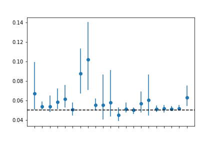

::: {.callout-note}
## From the archive (2020)

I wrote this in the first months of the COVID-19 pandemic, when rapid serological tests were deployed at remarkable scale while their performance characteristics remained anyone's guess. The numbers are historical now; the problem of inferring an unobservable rate from measurements made by other, uncalibrated instruments did not expire with the virus.
:::

Manufacturers reported sensitivity and specificity figures, but these came from heterogeneous validation studies, and the numbers circulating publicly carried very little information about how each test would behave in the field. Meanwhile the quantity everyone actually wanted, the true prevalence of infection, is not directly observable: what a serosurvey measures is a stream of test results, and converting those results into prevalence requires knowing how often the test itself is wrong, which you also don't know.

The relationship between what we observe and what we want to infer is a simple deconvolution. Let \(p_{\text{obs}}\) be the observed proportion of positive tests in a population of size \(N\). The observed frequency is a mixture of two error-prone contributions:

\[
p_{\text{obs}} = p_{\text{prev}} (1 - p_{\text{fnr}}) + (1 - p_{\text{prev}}) p_{\text{fpr}},
\]

where \(p_{\text{fnr}}\) and \(p_{\text{fpr}}\) denote the false-negative and false-positive rates of the test, respectively. So, essentially: the observed positives are the real positives discounted by the true-positive rate, plus the false positives contributed by everyone else. And note what that means when prevalence is low: the second term dominates, and a test with an apparently respectable specificity can generate more false positives than true positives.

Since all three quantities on the right-hand side are unknown, point estimates are not enough; the honest treatment is a joint inference problem. I placed weakly informative priors on \(p_{\text{prev}}\), \(p_{\text{fpr}}\), and \(p_{\text{fnr}}\), wrapped the model in PyMC, and sampled the joint posterior with NUTS. The result is a distribution over all three unknowns, and any single number quoted from it arrives with the spread that justifies it.

For the test-specific error rates I used the sensitivity and specificity data that manufacturers report to the US FDA. The single-test equation generalizes naturally when more than one test is in play. For \(K\) tests, the observed counts \(y_k\) follow binomial distributions with test-specific sensitivities and specificities, and a hierarchical structure shares information across tests while still allowing test-specific effects. This is the statistically sensible way to compare tests on a common scale: each test informs the others through the shared population-level prevalence, and the posterior for each test's error rates is regularized by the collective evidence rather than resting on its own (often thin) validation data.

One consequence is immediate and uncomfortable: for the same number of observed positives, different tests imply different real prevalences (@fig-tests).

{#fig-tests}

A simulation study confirmed unbiased prevalence estimates when the model is correctly specified. Applied to the FDA-reported data, it showed how raw observed positivity rates are adjusted, and how uncertainty in test performance propagates into the prevalence estimates rather than being silently absorbed into a single number. The practical consequence is risk-awareness by construction: the decision-maker sees not only a prevalence estimate but also the width of the uncertainty around it, driven by exactly the quantities that were least firmly known: the test error rates.

## Take-home messages

- When prevalence is low, specificity dominates everything: respectable-looking tests can generate more false positives than true positives.
- Prevalence, false-positive rate and false-negative rate are entangled; the joint posterior over the three of them is the unit of honesty.
- Uncertainty in instrument performance propagates into the answer by construction; decision-makers see the width as well as the point.

If I rebuilt it today, the extensions write themselves: hierarchical population structure for regional or demographic disaggregation, and priors borrowed from related pathogens. In the early-pandemic regime, prior information was the scarcest resource, and exactly what this model wanted.
